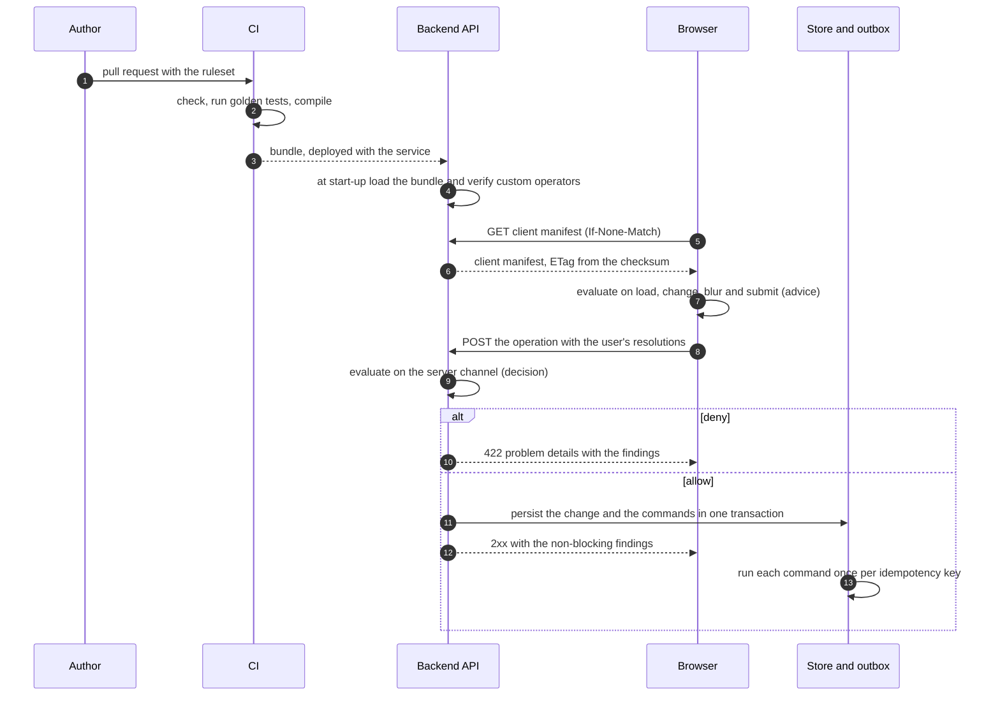

# Enforcing rules on the UI and the backend: step by step

This guide is for an engineer who adds Rule Cascade to an existing product with a web front end and
an API. It gives a procedure to follow (section 2), a table of responsibilities (section 3), a
checklist to audit against (section 4) and the mistakes that are made most often (section 5).

The words MUST, MUST NOT, SHOULD and MAY are used as in RFC 2119. The running example is the
payments contract in [`examples/contracts`](../examples/contracts), which the
[React example](../examples/frontend-react) and the
[Spring Boot example](../examples/backend-spring-boot) both enforce. The rules themselves are
explained in the [rule cookbook](cookbook.md); the exact behaviour of every runtime is defined by
the [specification](../spec/v1/SPECIFICATION.md).

- [1. The model](#1-the-model)
- [2. The procedure](#2-the-procedure): steps 1 to 8
- [3. Who does what](#3-who-does-what)
- [4. Audit checklist](#4-audit-checklist)
- [5. Common mistakes](#5-common-mistakes)

## 1. The model

Rules are written once, in a **ruleset** (a YAML or JSON document). CI checks the ruleset and
compiles it into a **bundle**: one JSON document that holds two **manifests**, the `server` manifest
with every rule and the `client` manifest with only the rules a browser may see. The backend loads
the bundle when it starts and evaluates every state-changing operation against the server manifest;
that result is the decision. The browser fetches the client manifest and evaluates the same rules
while the user works; that result is advice. Evaluation is a pure function: the same manifest and
the same request give the same result in every runtime, so the UI and the API agree wherever they
were given the same facts.



| Term | Meaning |
|---|---|
| Channel | Which manifest evaluates: `client` (advice, in the UI) or `server` (the decision, in the API) |
| `enforcement` | Per rule. `client`: only in the client manifest, a hint. `server`: only in the server manifest, never sent to a browser. `both` (the default): in both manifests |
| Trigger | The client moment a rule listens to: `load`, `change`, `blur`, `submit`. The default is `[submit]`. A server evaluation ignores triggers and runs every rule of the operation |
| View | A place in the UI: `page`, `screen`, `section`, `component`. A request with a `view` evaluates only the rules of that place and the rules that name no place |
| Finding | One violated validation rule: code, severity, message, the fields it points at, and whether it is `blocking` |
| Effect | A computed value (`type: value`) or the state of a field (`type: state`: `visible`, `enabled`, `required`, `readOnly`) |
| Command | A side effect a rule requests after an allowed server evaluation. The host runs it after it has persisted the change |
| Resolution | The user's answer to a finding: `acknowledge` for a warning, `accept-risk` with a justification for an error |

The decision is `deny` when at least one finding is blocking, otherwise `allow`.

**A client `allow` never implies that the server will accept.** There are four reasons, and each one
alone is sufficient:

1. The client manifest does not contain the rules with `enforcement: server`, nor any action rule.
   The payments example blocks transfers to sanctioned countries on the server only:

   ```text
   Transfer create | data: {"beneficiary": {"country": "KP"}} | channel: client
   => allow
   Transfer create | data: {"beneficiary": {"country": "KP"}}
   => deny  ORG-TRF-001 error blocking /beneficiary/country "Transfers to KP are not permitted."
   ```

   (The notation is explained in the [cookbook](cookbook.md#conventions): the first line of each
   pair is the request, the lines after `=>` are the real result.)
2. The server evaluates with facts the browser does not have or cannot be trusted with: the
   authenticated `actor`, the stored `original` and the server clock in `ctx.now`.
3. The browser may hold an older client manifest than the one the server enforces (step 8).
4. The browser is under the user's control. A request can be sent without the UI.

A host therefore MUST evaluate on the server for every state-changing operation, whatever the
client reported (specification section 9).

## 2. The procedure

Do the steps in order. Each step ends with what "done" looks like.

### Step 1. Describe the API in OpenAPI and bind its operations

A ruleset is checked against the API description, so the description comes first.

1. Give the entity a component schema. Every path a rule reads (`data.beneficiary.country`) is
   checked against it when the ruleset is loaded.
2. Name the ruleset once at the root with `x-rule-cascade`, and tag every operation that the rules
   govern with the entity and the rule operation it triggers. A rule operation is `create`, `read`,
   `update`, `delete`, `list` or any lower-case action name such as `approve`.
3. Declare the three places where rule results travel: `resolutions` in the request body, the
   evaluation in the success response, and a `422` response for a denied operation.

```yaml
x-rule-cascade:
  ruleset: acme.payments.transfer
  version: ^1.0.0

paths:
  /transfers:
    post:
      operationId: createTransfer
      x-rule-cascade: { entity: Transfer, operation: create }
      requestBody:
        required: true
        content:
          application/json:
            schema: { $ref: "#/components/schemas/TransferRequest" }
      responses:
        "201":
          description: Created. Non-blocking findings are returned alongside the resource.
          content:
            application/json:
              schema: { $ref: "#/components/schemas/TransferEnvelope" }
        "422": { $ref: "#/components/responses/RuleViolation" }

components:
  schemas:
    TransferRequest:
      type: object
      required: [transfer]
      properties:
        transfer: { $ref: "#/components/schemas/Transfer" }
        resolutions:
          type: array
          items:
            $ref: "../../spec/v1/rule-evaluation.openapi.yaml#/components/schemas/Resolution"
```

`TransferEnvelope` holds the transfer and the evaluation; `RuleViolation` is a problem-details
document (RFC 9457) with the evaluation attached. Both reference the `EvaluationResult` schema of
[`rule-evaluation.openapi.yaml`](../spec/v1/rule-evaluation.openapi.yaml).
The complete file is [`payments.openapi.yaml`](../examples/contracts/payments.openapi.yaml);
[OpenAPI and Rule Cascade](openapi.md) describes the binding in full.

**Done when** every state-changing operation of the API has an `x-rule-cascade` tag and a `422`
response, and its request body has a place for `resolutions`.

### Step 2. Write the ruleset

Put the ruleset next to the API description, in a file named `<domain>-<capability>.ruleset.yaml`.
Parents (`extends`) are looked up among the `*.ruleset.*` files of the same directory, and the
entity's `$ref` is resolved relative to the ruleset. A first version of the payments ruleset:

```yaml
ruleCascade: 1.0.0
kind: RuleSet

metadata:
  id: acme.payments.transfer
  version: 1.0.0
  title: Retail payments - create transfers
  owner: payments-platform

scope:                                   # who owns these rules, least specific first
  - { level: organization, id: acme }
  - { level: application, id: payments-hub }
  - { level: feature, id: transfers }

entities:
  Transfer:                              # the component schema of step 1
    schema: { $ref: "./payments.openapi.yaml#/components/schemas/Transfer" }
    fieldTypes: { /amount: Money, /fee: Money }

types:
  Money: { base: number, description: An amount with at most two decimals. }

params:
  maxTransferAmount:
    { type: number, default: 25000, overridePolicy: tighten-only, tightenDirection: lower }

rules:
  - id: transfer.amount.limit
    kind: validation
    target: { entity: Transfer, component: amount-panel, field: /amount }
    operations: [create]
    triggers: [blur, submit]
    when: { op: exists, args: [ { var: data.amount } ] }
    assert: { op: lte, args: [ { var: data.amount }, { var: params.maxTransferAmount } ] }
    severity: error
    finding:
      code: PAY-TRF-002
      message: transfer.amountOverLimit
      args: { limit: { var: params.maxTransferAmount } }

  - id: type.money.two-decimals              # runs once for every field bound to Money
    kind: validation
    target: { type: Money }
    operations: [create]
    triggers: [blur, submit]
    when: { op: eq, args: [ { op: typeOf, args: [ { var: value } ] }, number ] }
    assert: { op: eq, args: [ { op: round, args: [ { var: value }, 2 ] }, { var: value } ] }
    severity: error
    finding: { code: PAY-TRF-003, message: money.twoDecimals }

messages:
  en:
    transfer.amountOverLimit: "Amount exceeds the single-transfer limit of {limit}."
    money.twoDecimals: "Amounts can have at most two decimals."

bindings:
  openapi:
    - document: ./payments.openapi.yaml
      entity: Transfer
      operations: { create: createTransfer }

tests:
  - name: a transfer over the limit is denied
    entity: Transfer
    operation: create
    given:
      data:
        { type: domestic, amount: 30000.005, currency: USD, beneficiary: { name: Sam, country: US } }
    expect:
      decision: deny
      findings:
        - rule: transfer.amount.limit
          message: Amount exceeds the single-transfer limit of 25000.
        - { rule: type.money.two-decimals, fields: [/amount] }
```

The complete ruleset of the example is
[`payments-transfer.ruleset.yaml`](../examples/contracts/payments-transfer.ruleset.yaml).

| Section | What to write | More |
|---|---|---|
| `metadata`, `scope` | The id, the semantic version, the owner and the position in the organisation | [Cookbook 2](cookbook.md#2-where-a-rule-applies) |
| `entities`, `types` | One entity per component schema; bind fields that share a meaning to a type | [Cookbook 5](cookbook.md#5-rules-by-data-type) |
| `params` | Every number or list a business owner may want to change, with its override policy | [Cookbook 6](cookbook.md#6-reusable-logic-functions-and-parameters) |
| `rules` | One rule per constraint. Set `enforcement: server` on rules a browser must not see | [Cookbook 3](cookbook.md#3-severity), [4](cookbook.md#4-recipes-by-data-type) |
| `messages` | The text users read, per locale. Every message key and placeholder is checked at load | |
| `bindings` | The same mapping as the `x-rule-cascade` tags, from the ruleset's side | [OpenAPI](openapi.md) |
| `tests` | Golden tests: at least one request that passes and one for every blocking rule | [Cookbook 9](cookbook.md#9-golden-tests) |

To start from the constraints the API description already states (`required`, `enum`, `maxLength`,
`pattern` ...), derive a baseline and build on it:

```console
$ rcas derive payments.openapi.yaml --schema Transfer \
    --id acme.generated.transfer --scope organization:acme,application:payments-hub \
    -o transfer-baseline.ruleset.yaml
wrote transfer-baseline.ruleset.yaml  acme.generated.transfer  30 rules derived, 0 constraint(s) skipped
```

[OpenAPI and Rule Cascade, section 3](openapi.md#3-baseline-rules-are-derived-from-schema-constraints)
lists what is and is not derived, and how to extend the baseline or copy from it.

**Done when** the file loads and its golden tests pass (step 3).

### Step 3. Check and compile in CI

Use `rcas`: a single file for Linux, macOS and Windows that needs nothing else
([install](https://rulescascade.com/get-started/install/); in CI, `npx -y @rules-cascade/cli`). The
Python reference implementation gives the same results.

1. Check every ruleset. The command lints the YAML, loads the ruleset with its parents, verifies the
   OpenAPI bindings and runs the golden tests.

   ```console
   $ rcas check examples/contracts/*.ruleset.yaml
   acme.org.base@1.2.0  sha256:4dff42ddd5da...  3 rules (2 client-safe), 2 params
     3 golden tests, 0 failed
   acme.payments.transfer@1.0.0  sha256:c192dd53b5b1...  14 rules (9 client-safe), 4 params
     14 golden tests, 0 failed
   ```

2. Compile the bundle and keep it as a build artefact.

   ```console
   $ rcas compile examples/contracts/payments-transfer.ruleset.yaml \
       -o build/acme.payments.transfer.bundle.json
   wrote build/acme.payments.transfer.bundle.json  acme.payments.transfer@1.0.0  sha256:c192dd53b5b1d307d52ccbc27fc1674114e8714d53b699b24088a648ae242c7e
   ```

3. Fail the pipeline when either command exits with a non-zero status. `check` exits with status 1
   for each of the following (the outputs are those of the ruleset of step 2 with one line broken):

| What is wrong | Output of `check` |
|---|---|
| A load error: any code of [specification section 5](../spec/v1/SPECIFICATION.md#5-loading), for example a path that is not in the API schema | `LOAD FAILED` and `PATH_UNKNOWN: transfer.amount.limit path data.amont is not in the Transfer schema` |
| A golden test does not hold | `FAIL  a transfer over the limit is denied` and the difference, such as `decision "deny" != "allow"` |
| An unquoted scalar that YAML 1.1 and YAML 1.2 parsers read differently (`no`, `on`, `012`, `2026-10-03` ...), an anchor, an alias, a tag, a merge key or a repeated key | `YAML_NOT_PORTABLE: line 68: quote 'no'; YAML parsers disagree about unquoted no` |
| A number with more than 15 significant digits | `NUMBER_NOT_PORTABLE: /params/maxTransferAmount/default: 25000.123456789013 has more than 15 significant digits; runtimes read it as the nearest double` |
| The ruleset's `bindings` and the API's `x-rule-cascade` tags disagree, or a rule uses an operation the API does not have | `BINDING_MISMATCH: operationId createTransfers is not in ./payments.openapi.yaml` |

Both `compile` commands refuse a file with a load error or a `YAML_NOT_PORTABLE` problem. The
golden tests, the number lint and the binding check run only in `check`, so run `check` before
`compile`.

**Done when** the pipeline runs `check` on every ruleset on every pull request, and the bundle that
is deployed is the one the pipeline compiled.

### Step 4. Enforce on the backend

The backend holds the decision. It does seven things, in this order.

1. **Load at start-up, and fail start-up on a load error.** A runtime MUST NOT serve a ruleset that
   failed to load. Let the load error end the process, so that a deployment with a broken ruleset
   never becomes ready.

   | Runtime | Read the bundle built in CI | Or compile the source at start-up | Error |
   |---|---|---|---|
   | Java | `RuleSet.fromBundle(map)` | `RuleSet.load(document, registry, schemaLoader)` | `LoadException` |
   | TypeScript | `RuleSet.fromBundle(json)` | `loadRuleSet(document, registry, options)` | `LoadError` |
   | Python | `RuleSet.from_bundle(json)` | `load(document, registry, loader)` | `LoadError` |
   | Go | `rulecascade.FromBundle(json)` | `rulecascade.Load(document, registry, loader)` | `*LoadError` |

   Prefer the bundle: it is exactly what CI checked, and the service needs no YAML parser. A bundle
   is trusted as it is, so load it only from a source you control.
2. **Verify the custom operators.** A manifest lists the custom operators (`x-*`) its rules need
   under `operators`. Every runtime reports the ones that are needed, on any channel the ruleset
   has, and not registered. Refuse to start when the list is not empty: at evaluation time a rule
   whose operator is missing can only fail closed.

   | Runtime | The custom operators that are needed and not registered |
   |---|---|
   | Java | `rules.missingOperators()`, on the ruleset returned by `withOperators(operators)` |
   | TypeScript | `rules.missingOperators(operators)` |
   | Python | `rules.missing_operators(operators)` |
   | Go | `rules.MissingOperators(operators)` |

3. **Evaluate on every state-changing operation**, on the server channel, with a request built from
   the server's own facts:

   | Member | Source on the server |
   |---|---|
   | `entity`, `operation` | The `x-rule-cascade` tag of the API operation. Never from the caller |
   | `data` | The request body after shape validation (step 7), with the fields the server assigns |
   | `original` | The stored record, for every operation except `create`. MUST come from the store |
   | `actor` | `id` and `roles` from authentication. MUST NOT come from the payload or from a header the caller controls |
   | `ctx.now` | The server clock, as an RFC 3339 date-time. The engine never reads a clock |
   | `resolutions` | The `resolutions` member of the request body |
   | `locale` | The user's language tag. A regional tag falls back: `fr-CA` reads `fr-CA`, then `fr`, then the default locale |

   A request that does not have the shape of an evaluation request (for example a resolution
   without a `rule`) is refused before anything is evaluated. Answer `400`.

   The host decides which operations exist. An entity the ruleset does not know, or an operation
   that no rule lists, selects no rule and evaluates to `allow` with no findings. Take both names
   from the `x-rule-cascade` tag of the route, never from the request.
4. **On `deny`, return `422`** with RFC 9457 problem details that carry the whole evaluation result.
   Change nothing.
5. **On `allow`, apply the computed values and persist.** The result carries effects, not the
   computed record: write each `value` effect of the server evaluation into the record before you
   store it, and ignore what the client sent for a computed field. Write the returned commands to
   an outbox in the same transaction as the change.
6. **Run each command once.** A relay publishes the outbox after the transaction has committed and
   MUST de-duplicate on `idempotencyKey`. Commands are never run before persistence and never run
   for a denied operation: the engine returns them only for an allowed server evaluation.
7. **Return the evaluation with the success response and log the decision.** Non-blocking findings
   (information, warnings, acknowledged warnings, accepted errors) travel with the `2xx` response
   so the UI can show them. Log the ruleset id, version and checksum with the decision, the finding
   codes and the actor. For a finding with status `accepted`, also record the justification from
   the request: it is the audit trail of an accepted risk.

For a `read` operation the same evaluation returns field state. Remove the fields whose state is
`visible: false` from the response, as the `read` method of
[`TransferController`](../examples/backend-spring-boot/src/main/java/com/example/payments/TransferController.java)
does.

The four listings below show the same `create` operation. In them `rules` and `operators` are the
ruleset and the operators of items 1 and 2, and `store`, `log` and `caller` stand for the service's
persistence with its outbox, its logger and its authenticated principal.

#### Java and Spring Boot

From [`examples/backend-spring-boot`](../examples/backend-spring-boot). Start-up, in
`RuleCascadeConfiguration`; an exception that leaves the bean method stops the application:

```java
RuleSet loaded = bundleLocation.isBlank()
        ? compile(location, rulesetId) : readBundle(bundleLocation, rulesetId);

RuleSet rules = loaded.withOperators(CustomOperators.all());
List<String> missing = rules.missingOperators();
if (!missing.isEmpty()) {
    throw new IllegalStateException("ruleset " + rules.id()
            + " needs custom operators that are not registered: " + missing);
}
return rules;
```

Every operation, in `TransferController`. `check` builds the request, adds the resolutions of the
body, evaluates, and throws when the decision is `deny`:

```java
EvaluationRequest.Builder builder = EvaluationRequest.builder(ENTITY, operation)
        .data(data)
        .original(original)
        .actor(actorId, roles);

EvaluationResult result = rules.evaluate(request);
if (!result.allowed()) {
    throw new RuleViolationException(result);
}
```

```java
EvaluationResult result = check("create", transfer, null, actorId, roles, body);
applyComputedValues(transfer, result);
store.put((String) transfer.get("id"), transfer);
run(result);
return ResponseEntity.status(HttpStatus.CREATED).body(envelope(transfer, result));
```

`ApiExceptionHandler` turns `RuleViolationException` into the `422` response: a `ProblemDetail` of
type `urn:rule-cascade:rule-violation` with `result.toMap()` as its `evaluation` property. `run`
handles each command once per `idempotencyKey()`.

Three things in the example are shortened and MUST be different in a service of your own. It reads
the actor from two request headers; take it from the security context. It keeps the handled
idempotency keys in memory; use an outbox table. And the payments ruleset reads no clock, so the
example passes no `ctx`; a ruleset that reads `ctx.now` needs
`.ctx(Map.of("now", Instant.now().toString()))` on the builder.

#### Node.js and TypeScript

```ts
import { computedValues, type JsonObject, type Resolution } from '@rules-cascade/core';

type CreateBody = { transfer: JsonObject; resolutions?: Resolution[] };

export async function createTransfer(body: CreateBody, caller: Caller) {
  const transfer: JsonObject = { ...body.transfer, id: randomUUID(), status: 'draft' };
  const result = rules.evaluate({                  // throws RequestError when malformed: answer 400
    entity: 'Transfer',
    operation: 'create',
    data: transfer,
    original: null,                                 // update, delete, actions: the stored record
    actor: { id: caller.id, roles: caller.roles },  // from the verified token, never from the body
    ctx: { now: new Date().toISOString() },         // the server clock
    resolutions: body.resolutions,
  }, 'server', operators);
  const { ruleset, version, checksum, decision } = result;
  const findings = result.findings.map((f) => `${f.code}:${f.status}`);
  log.info({ ruleset, version, checksum, decision, findings, actor: caller.id });

  if (decision === 'deny') {
    const problem = { type: 'urn:rule-cascade:rule-violation', title: 'Business rule violation' };
    return { status: 422, body: { ...problem, status: 422, evaluation: result } };
  }
  for (const [pointer, value] of Object.entries(computedValues(result))) {
    if (pointer.lastIndexOf('/') === 0) transfer[pointer.slice(1)] = value;   // such as /fee
  }
  await store.transaction(async (tx) => {
    await tx.save(transfer);
    for (const command of result.commands) await tx.outbox(command.idempotencyKey, command);
  });
  return { status: 201, body: { transfer, evaluation: result } };  // with the non-blocking findings
}
```

#### Python

```python
def create_transfer(body, caller):
    transfer = dict(body["transfer"], id=str(uuid.uuid4()), status="draft")
    result = rules.evaluate({                       # raises RequestError when malformed: answer 400
        "entity": "Transfer",
        "operation": "create",
        "data": transfer,
        "original": None,                           # update, delete, actions: the stored record
        "actor": {"id": caller["id"], "roles": caller["roles"]},    # from the verified token
        "ctx": {"now": datetime.now(timezone.utc).isoformat()},     # the server clock
        "resolutions": body.get("resolutions"),
    }, "server", operators)
    log.info("ruleset=%s version=%s checksum=%s decision=%s findings=%s actor=%s",
             result["ruleset"], result["version"], result["checksum"], result["decision"],
             [f"{f['code']}:{f['status']}" for f in result["findings"]], caller["id"])

    if result["decision"] == "deny":
        return 422, {"type": "urn:rule-cascade:rule-violation", "title": "Business rule violation",
                     "status": 422, "evaluation": result}
    for effect in result["effects"]:
        if effect["type"] == "value" and effect["field"].rfind("/") == 0:
            transfer[effect["field"][1:]] = effect["value"]         # such as /fee
    with store.transaction() as tx:
        tx.save(transfer)
        for command in result["commands"]:
            tx.outbox(command["idempotencyKey"], command)
    return 201, {"transfer": transfer, "evaluation": result}       # with the non-blocking findings
```

#### Go

```go
func createTransfer(transfer map[string]any, resolutions []any, caller Caller) (int, any) {
	transfer["id"], transfer["status"] = newID(), "draft"
	result, err := rules.Evaluate(map[string]any{
		"entity":    "Transfer",
		"operation": "create",
		"data":      transfer,
		"original":  nil, // update, delete, actions: the stored record
		// The actor comes from the verified token and the time from the server clock.
		"actor":       map[string]any{"id": caller.ID, "roles": caller.Roles},
		"ctx":         map[string]any{"now": time.Now().UTC().Format(time.RFC3339)},
		"resolutions": resolutions,
	}, "server", operators)
	var malformed *rulecascade.RequestError
	if errors.As(err, &malformed) {
		return 400, map[string]any{"title": malformed.Message}
	} else if err != nil {
		return 500, nil
	}
	log.Printf("ruleset=%s version=%s checksum=%s decision=%s findings=%d actor=%s", result.Ruleset,
		result.Version, result.Checksum, result.Decision, len(result.Findings), caller.ID)

	if !result.Allowed() {
		return 422, map[string]any{"type": "urn:rule-cascade:rule-violation",
			"title": "Business rule violation", "status": 422, "evaluation": result}
	}
	for _, effect := range result.Effects {
		if effect.Type == "value" && strings.LastIndex(effect.Field, "/") == 0 {
			transfer[effect.Field[1:]] = effect.Value // such as /fee
		}
	}
	err = store.Transaction(func(tx tx) error {
		if err := tx.Save(transfer); err != nil {
			return err
		}
		for _, command := range result.Commands {
			if err := tx.Outbox(command.IdempotencyKey, command); err != nil {
				return err
			}
		}
		return nil
	})
	if err != nil {
		return 500, nil
	}
	// The non-blocking findings travel with the success.
	return 201, map[string]any{"transfer": transfer, "evaluation": result}
}
```

#### Any other language

A program in a language without a library has two options. Both return the evaluation result of
the libraries, and the seven obligations above stay with the caller.

**The command.** `rcas evaluate` answers one request:

```console
$ echo '{"entity": "Transfer", "operation": "create", "data": {"type": "domestic", "amount": -5}}' |
    rcas evaluate --bundle build/acme.payments.transfer.bundle.json
```

It prints the evaluation result as JSON (here `"decision": "deny"` with the findings `ORG-TRF-003`
and `PAY-TRF-001`) and exits with status 0 whatever the decision. A service keeps one
`rcas engine` process alive instead, sends `load` once and then one `evaluate` line per
request; [`examples/engine-clients`](../examples/engine-clients/README.md) has clients in nine
languages, and the same engine as a WebAssembly module. The answer to `load` lists the custom
operators the engine lacks as `missingOperators`: refuse to start when it is not empty.

**The rule server.** [`packages/server`](../packages/server/README.md) serves the same evaluation
over HTTP: `POST /evaluations` with the evaluation request plus `"ruleset": "<id>"` returns the
evaluation result. Set `RULE_SERVER_TOKEN`, and keep the endpoint away from browsers: it evaluates
whatever `actor` the caller sends, so only your backend may call it.

Custom operators cannot cross a process boundary. The command and the `rule-cascade-server` command
have none of yours, so a rule that calls one fails closed. Use a library, or build the command or
the server with your operators registered.

**Done when** no state-changing endpoint can persist anything before an allowed server evaluation,
and a test proves that a request denied by a server-only rule returns `422` and changes nothing.

### Step 5. Serve the client manifest

1. Expose `GET <base>/rulesets/{id}/manifest?channel=client`. That is the path the manifest client
   of the TypeScript runtime requests.
2. Answer with the **client** manifest only. The server manifest and the bundle contain the
   server-only rules and parameters; they MUST NOT be reachable from a browser.
3. Set the `ETag` from the ruleset checksum and answer `304` to a matching `If-None-Match`. Use
   `Cache-Control: no-cache`, which lets the browser keep its copy and revalidate it on every use,
   so a rule change reaches the UI at the next fetch.

Spring Boot, in
[`RuleCascadeController`](../examples/backend-spring-boot/src/main/java/com/example/payments/RuleCascadeController.java):

```java
if (!"client".equals(channel)) {
    throw new ResponseStatusException(HttpStatus.FORBIDDEN, "only the client manifest is served");
}
String etag = "\"" + rules.checksum() + "\"";
if (request.checkNotModified(etag)) {
    return null; // 304, headers already set
}
return ResponseEntity.ok()
        .eTag(etag)
        .cacheControl(CacheControl.noCache())
        .body(rules.manifest(Channel.CLIENT));
```

In Node.js the same three lines are `rules.manifest('client')` for the body, `rules.checksum` for
the `ETag`, and a `304` when `If-None-Match` equals it.

The rule server has the endpoint built in and needs no token for the client channel. A static file
works too: `rcas manifest <bundle>` prints the client manifest, and CI can publish it under
a name that contains the checksum.

The client manifest contains the rules with `enforcement: client` or `both` except action rules,
and only the functions, parameters and messages those rules use. For the payments example that is
9 of the 14 rules, and the parameter `blockedCountries` is not in it. Everything in it is readable
by any user: a threshold, a pattern or a message that must stay private belongs in a rule with
`enforcement: server`.

**Done when** the UI can fetch the manifest, a second fetch returns `304`, and requesting
`channel=server` or the bundle without backend credentials fails.

### Step 6. Evaluate in the UI

The UI contains no rule logic. It builds a request from the form, evaluates it against the client
manifest, and draws the result.

1. **Fetch and cache the manifest.** `createManifestClient({ baseUrl })` fetches it, keeps it in
   memory and revalidates it with the `ETag` on every `get`. When the server cannot be reached and
   a manifest is cached, `get` answers with the cached one and calls `onStale`, so the form keeps
   working; the API still decides when the form is submitted.
2. **Build the request** from the form state:

   | Member | Source in the UI |
   |---|---|
   | `entity`, `operation` | Constants of the screen: a create form sends `create`, an edit form `update` |
   | `data` | The form state in the shape of the entity. Convert before you evaluate: an empty input is `null`, not `""`, and a number is a number, not a string |
   | `original` | On an edit screen, the record as it was loaded |
   | `actor` | The id and roles the session knows. They drive field state and who may accept a risk; the server takes its own |
   | `ctx.now` | The browser clock, read once when the screen opens. Rules that read `ctx.now` fail closed without it |
   | `resolutions` | What the user has acknowledged or accepted so far |
   | `locale` | The language tag of the UI, for example `fr-CA`. Messages fall back to `fr`, then to the default locale |

3. **Evaluate the whole screen after every change.** Use no `trigger`, and the screen's `view` when
   the form spans several screens, for example `view: { page: 'onboarding', screen: 'finance' }`.
   This result is complete for the screen. Use it for the effects (item 4) and for the submit gate:
   the form may be sent when its `decision` is `allow`. Evaluate without a `view` before the final
   submit of a form that spans several screens.
4. **Apply the effects.**
   - A `state` effect sets `visible`, `enabled`, `required` or `readOnly` on a field. An effect
     exists only while its rule applies, so decide a default for every field a state rule can touch.
     In the payments form the SWIFT field is hidden unless a rule shows it.
   - A `value` effect is a computed value. Display it; do not let the user edit it. The server
     computes it again and stores its own value.
5. **Show findings when their trigger has occurred.** A request with `trigger: 'load'`, `'change'`
   or `'blur'` evaluates only the rules that listen to that moment, so its result is partial: use
   it to decide *which* findings the user has met, never to replace what the screen shows. Remember
   the findings a trigger evaluation returned, and display the findings of the complete evaluation
   (item 3) that have been met. When the user asks to submit, display them all.
6. **Draw each finding where it belongs.**

   | The finding has | Draw it |
   |---|---|
   | `fields` | Next to each field it points at. A rule with `forEach` points at one element, for example `/splits/1/share` |
   | No `fields`, or fields that are not on the screen | In the place `location` names (page, screen, section, component), or in a summary of the form |
   | `severity: error` | As an error. It blocks unless its status is `accepted` |
   | `severity: warning` | As a warning. It blocks only while its `resolution` is `acknowledge` and its status is `open` |
   | `severity: info` | As a hint. It never blocks |
   | Code `RULE-EVALUATION-ERROR` | In the summary, with its generic message. Report its `detail` to your error tracking: a rule met data it was not written for |

   Use `blocking` to decide whether a finding stops the submit. Do not derive it from the severity.
7. **Collect resolutions.** `finding.resolution` says what the user may do.
   - `acknowledge`: offer a confirmation. When the user confirms, add
     `{ rule, type: 'acknowledge' }` to `resolutions`; the next evaluation reports the finding with
     status `acknowledged` and it no longer blocks.
   - `accept-risk`: when the user holds one of the roles in `acceptableBy` (or the finding lists no
     roles), offer a justification field and add `{ rule, type: 'accept-risk', justification }`.
     Otherwise say who can accept; handing the operation to that person is your workflow.
   - `none`: the user has to change the data.
8. **Send the resolutions with the submit, and draw the server's findings the same way.** The body
   of a `422` carries an evaluation result with the same finding objects, so the code of item 6
   draws them. They can include findings of server-only rules the UI has never seen. A success
   response carries the non-blocking findings.
9. **Refresh the manifest when the checksum differs.** Every evaluation result names the checksum
   of the ruleset that produced it. When a response of the server names another checksum than the
   manifest in use, fetch the manifest again.

#### React

`useRuleEvaluation(manifest, request, operators?)` evaluates on every render and returns `allowed`,
`findings`, `states` (field state by pointer), `computed` (values by pointer) and
`findingsFor(pointer)`. The form below applies items 1 to 9. It contains no rule.

```tsx
import { useEffect, useState } from 'react';
import { createManifestClient } from '@rules-cascade/client';
import {
  evaluate, type EvaluationRequest, type EvaluationResult, type Finding,
  type Manifest, type Resolution, type Trigger,
} from '@rules-cascade/core';
import { useRuleEvaluation } from '@rules-cascade/client/react';

type User = { id: string; roles: string[] };
const manifests = createManifestClient({ baseUrl: '/api' });
const key = (f: Finding) => `${f.rule} ${f.fields.join(' ')}`;   // one rule, several findings
const ON_SCREEN = ['/amount', '/beneficiary/swiftCode'];         // the fields this form draws
type Text = string | null;                                       // an empty input is null, never ''
const EMPTY = {
  type: 'domestic', amount: null as number | null, currency: 'USD', memo: null as Text,
  beneficiary: { name: null as Text, country: null as Text, swiftCode: null as Text },
};

export function TransferForm({ user }: { user: User }) {
  const [manifest, setManifest] = useState<Manifest>();
  const [draft, setDraft] = useState(EMPTY);
  const [resolutions, setResolutions] = useState<Resolution[]>([]);
  const [shown, setShown] = useState<ReadonlySet<string>>(new Set());   // findings the user has met
  const [submitted, setSubmitted] = useState(false);
  const [server, setServer] = useState<EvaluationResult>();             // the evaluation of a 422
  const [now] = useState(() => new Date().toISOString());

  useEffect(() => {                                                                     // item 1
    void manifests.get('acme.payments.transfer').then(setManifest);
  }, []);

  const request = (data = draft): EvaluationRequest =>                                  // item 2
    ({ entity: 'Transfer', operation: 'create', data, actor: user, ctx: { now }, resolutions });
  // Items 3 and 4: the complete evaluation, on every render.
  const { allowed, states, computed, findings } = useRuleEvaluation(manifest, request());

  const reveal = (trigger: Trigger, data = draft) => {                                  // item 5
    if (!manifest) return;
    const met = evaluate(manifest, { ...request(data), trigger }).findings.map(key);
    setShown((seen) => new Set([...seen, ...met]));
  };
  useEffect(() => reveal('load'), [manifest]);
  const change = (patch: Partial<typeof EMPTY>) => {
    const next = { ...draft, ...patch };
    setDraft(next);
    setServer(undefined);
    reveal('change', next);
  };
  const resolve = (rule: string, resolution?: Resolution) =>                            // item 7
    setResolutions((all) =>
      [...all.filter((r) => r.rule !== rule), ...(resolution ? [resolution] : [])]);

  async function submit() {                                                             // item 8
    setSubmitted(true);
    if (!manifest || !allowed) return;
    const response = await fetch('/api/transfers', {
      method: 'POST',
      headers: { 'Content-Type': 'application/json' },
      body: JSON.stringify({ transfer: draft, resolutions }),
    });
    const body = await response.json();
    if (response.status === 422) setServer(body.evaluation);
    if (body.evaluation && body.evaluation.checksum !== manifest.checksum) {            // item 9
      setManifest(await manifests.get(manifest.id));
    }
  }

  // Item 6. After a 422 the server's findings are drawn, otherwise the client findings met so far.
  const visible = server ? server.findings : findings.filter((f) => submitted || shown.has(key(f)));
  const at = (pointer: string) => visible.filter((f) => f.fields.includes(pointer));
  const summary = visible.filter((f) => !f.fields.some((pointer) => ON_SCREEN.includes(pointer)));
  const swift = states['/beneficiary/swiftCode'] ?? {};          // hidden unless a rule shows it
  return (
    <form onSubmit={(e) => { e.preventDefault(); void submit(); }}>
      <input aria-label="Amount" inputMode="decimal" value={draft.amount ?? ''}
        onBlur={() => reveal('blur')}
        onChange={(e) =>
          change({ amount: e.target.value === '' ? null : Number(e.target.value) })} />
      <Findings list={at('/amount')} user={user} resolve={resolve} />
      {computed['/fee'] !== undefined && <p>Fee: {String(computed['/fee'])}</p>}
      {swift.visible && (
        <input aria-label="SWIFT / BIC" required={swift.required} readOnly={swift.readOnly}
          value={draft.beneficiary.swiftCode ?? ''} onBlur={() => reveal('blur')}
          onChange={(e) =>
            change({ beneficiary: { ...draft.beneficiary, swiftCode: e.target.value || null } })} />
      )}
      <Findings list={at('/beneficiary/swiftCode')} user={user} resolve={resolve} />
      {/* ... the other fields ... */}
      <Findings list={summary} user={user} resolve={resolve} />
      <button type="submit">Send transfer</button>
    </form>
  );
}
```

One component draws a finding with the resolution it offers:

```tsx
type Resolve = (rule: string, resolution?: Resolution) => void;

function Findings({ list, user, resolve }: { list: Finding[]; user: User; resolve: Resolve }) {
  const [why, setWhy] = useState('');
  const mayAccept = (f: Finding) =>
    !f.acceptableBy || f.acceptableBy.some((role) => user.roles.includes(role));
  return (
    <ul>
      {list.map((f) => (
        <li key={key(f)} className={`finding-${f.severity}`} role={f.blocking ? 'alert' : 'status'}>
          {f.message}
          {f.resolution === 'acknowledge' && (
            <label>
              <input type="checkbox" checked={f.status === 'acknowledged'}
                onChange={(e) => resolve(f.rule,
                  e.target.checked ? { rule: f.rule, type: 'acknowledge' } : undefined)} />
              I have checked this
            </label>
          )}
          {f.resolution === 'accept-risk' && f.status === 'open' && (mayAccept(f) ? (
            <>
              <input placeholder="Justification" value={why}
                onChange={(e) => setWhy(e.target.value)} />
              <button type="button" disabled={why.trim() === ''} onClick={() =>
                resolve(f.rule, { rule: f.rule, type: 'accept-risk', justification: why })}>
                Accept the risk
              </button>
            </>
          ) : (
            <em>Needs acceptance by: {(f.acceptableBy ?? []).join(', ')}</em>
          ))}
        </li>
      ))}
    </ul>
  );
}
```

[`examples/frontend-react`](../examples/frontend-react) is a complete, styled form built on the
same hook. A manifest that lists custom operators needs them as the third argument of the hook and
of `evaluate`; pass the same object on every render.

#### Any other UI framework

The hook is a memo around `evaluate(manifest, request, operators)`, which is synchronous and has no
dependency on a framework. Vue, Angular, Svelte, web components and plain scripts call it directly
and read the result with three helpers:

```ts
import {
  computedValues, evaluate, fieldStates, findingsFor,
} from '@rules-cascade/core';

// After every change: the complete evaluation of the screen.
const result = evaluate(manifest, request, operators);
const allowed = result.decision === 'allow';     // the submit gate
const states = fieldStates(result);              // states['/beneficiary/swiftCode'].visible is true
const computed = computedValues(result);         // computed['/fee'] is 7.5
const swiftFindings = findingsFor(result, '/beneficiary/swiftCode');   // PAY-TRF-002

// On an event: which findings has the user met? Here, the blur of a field in one component.
const view = { component: 'beneficiary-panel' };
const met = evaluate(manifest, { ...request, trigger: 'blur', view }, operators).findings;
```

Keep the findings of `met` in the component's state, as the React form keeps `shown`, and draw the
findings of `result` that are among them.

#### Mobile and desktop apps

| The app is built with | Use |
|---|---|
| Web technology (React Native, Electron, a web view) | The TypeScript runtime with the client manifest, exactly as above |
| Java or Kotlin, Python, Go | The library, with the client manifest fetched from the API: `RuleSet.fromManifest(manifest)` in Java, `RuleSet.from_manifest(manifest)` in Python, `rulecascade.FromManifest(manifest)` in Go. A ruleset read from the client manifest has the client channel only. Java's `rules.evaluate(request)`, Python's `rules.evaluate(request)` and Go's `rules.Evaluate(request, "", nil)` then use it |
| Any other language (Swift, C#, C++, Rust ...) | The command or the WebAssembly module with the client manifest: `load` with `"manifest"` in the engine protocol, or `rcas evaluate --manifest client.manifest.json`. Asking such a ruleset for the server channel is refused (`CHANNEL_UNAVAILABLE`) |
| Nothing that can evaluate locally | A dry-run endpoint of your API that evaluates on the **client** channel and persists nothing, such as `POST /evaluations` in the Spring Boot example. It is advice, so it must not reveal server-only rules |

A client receives the client manifest and nothing else. It MUST NOT be given the bundle, which
contains the server manifest. Mobile platforms are covered by this design but are not tested in this
repository.

Whatever the client is, the server evaluates again.

**Done when** the form shows field state, computed values and findings without a round trip, an
acknowledged warning and an accepted error are sent as `resolutions`, and a `422` from the server is
drawn with the same components as a client finding.

### Step 7. Keep shape validation for the transport

Rule Cascade does not replace the validator of the transport (Zod, JSON Schema, Bean Validation).
Rules assume that a value has the type the API schema gives it, and they do not convert: a string
where a rule expects a number makes the rule fail closed.

```text
Customer create | data: {"dependents": "2"} | show: detail
=> deny
   RULE-EVALUATION-ERROR error blocking (rule customer.dependents.whole-number)
      "This rule could not be evaluated."
      detail: number expected, got '2'
```

That is safe, and useless to the user. Keep both layers and give each its job:

| | Shape validation | Rules |
|---|---|---|
| Question | Is this a request the API can read? | May this operation happen? |
| Checks | JSON types and structure, unknown properties, the size of the body, formats needed to parse a value | Everything a user can fix or a business owner decides: required fields, ranges, formats users type, cross-field logic, stored state, roles, time |
| Runs | First, before the stored record is loaded | After it, on data of the right shape |
| Fails with | `400` and a technical message. The UI should never cause it | `422` with findings the UI draws next to fields |
| Source | The OpenAPI schema | The ruleset |

On the server the order is: authenticate, validate the shape (`400`), load `original`, evaluate
(`422`), persist. In the UI, convert the form state to the entity shape before evaluating
(`toEntity` in the React example).

A constraint may appear in both layers on purpose. `rulecheck derive` (step 2) turns `required`,
`enum`, `maxLength` and similar schema constraints into rules, so that the UI shows them as
findings; the transport validator stays as the gate behind them.

**Done when** a malformed request is answered with `400` before any rule runs, and no golden test
needs a value of the wrong JSON type.

### Step 8. Roll out a rule change

1. **Change the ruleset in a pull request and raise its version.** A patch adds an `info` rule, a
   message or a test. A minor adds a warning without acknowledgement, a state or compute rule, or a
   parameter. A major adds an error rule or a warning that must be acknowledged, raises a
   severity, tightens a parameter, or removes or renames anything
   ([authoring guidelines](authoring-guidelines.md), section 1).
2. **Let CI check and compile.** The version identifies the document; the **checksum** identifies
   the resolved rules, parents included. A parent that changes within the range a child accepts
   (`^1.2.0`) changes the child's checksum but not its version. Pin `extends[].checksum` when a
   parent upgrade must be deliberate.
3. **Treat bundles as immutable.** Store each bundle under its id, version and checksum and never
   overwrite one. Rolling back is deploying the previous bundle.
4. **Deploy the backend.** A service that embeds a runtime gets the new bundle with a rolling
   deployment; a broken bundle stops start-up (step 4), so the rollout stops. The rule server
   reloads its directory on `SIGHUP` and keeps the previous rules when the new ones fail to load.
5. **Let the browsers follow.** Nothing has to be deployed to them: the next manifest fetch
   revalidates the `ETag` and receives the new client manifest.

During and after a rollout a browser can hold an older manifest than the server enforces. This is
safe by construction, because the server decides. What the user experiences:

| The new ruleset | A browser with the old manifest | What to do |
|---|---|---|
| Adds or tightens a blocking rule | Lets the user submit; the server answers `422` with the new finding, which the UI draws | Nothing. The response names the new checksum, so the UI refreshes (step 6, item 9) |
| Removes or relaxes a rule | Still blocks or warns locally, so no request is sent and no response reveals the change | Fetch the manifest when a screen opens, not once per session |
| Renames or removes a rule the user acknowledged | Sends a resolution for a rule the server does not have. The server ignores it | Nothing |
| Changes a message or a hint | Shows the old text until the next fetch | Nothing |

While old and new instances of the backend run side by side, either may serve the manifest and
either may evaluate. Both are correct for their own ruleset, and the checksum in each log line says
which one decided.

**Done when** the checksum of the deployed ruleset is visible in the logs of every decision, and a
rule change reaches production without a code change in the UI or the API.

## 3. Who does what

By kind of rule:

| Kind | The UI | The backend |
|---|---|---|
| `validation` | Evaluates for feedback and draws the findings | Evaluates again and denies while a finding is blocking |
| `state` | Shows, hides, enables, requires or locks the field | On `read`, removes the fields that are not visible. On a write the engine returns the state but does **not** reject a change to a read-only field (see below) |
| `compute` | Displays the value | Computes it again and stores its own value |
| `action` | Nothing. Action rules are never in the client manifest | Writes the commands to the outbox with the change and runs each once |

**A state rule never protects data.** It describes the form; a caller that ignores the form is
stopped only by a validation rule. The catalog shows the pair:
`customer.credit-limit.read-only-for-agents` locks the input for agents, and the server-only
`customer.credit-limit.change-needs-manager` refuses the change. An agent who changes the limit
anyway, on the server and then on the client channel:

```text
Customer update | data: {"creditLimit": 12000} | actor: {"id": "u-2", "roles": ["agent"]}
  | show: effects
=> deny
   ONB-UPD-003 error blocking /creditLimit "Only a credit manager can change the credit limit."
   effect value /displayName = "Maya Okafor" (customer.display-name.default)
   effect value /riskTier = "standard" (customer.risk-tier.derive)
   effect state /creditLimit {"readOnly": true} (customer.credit-limit.read-only-for-agents)
Customer update | data: {"creditLimit": 12000} | actor: {"id": "u-2", "roles": ["agent"]}
  | channel: client | show: effects
=> allow
   effect value /displayName = "Maya Okafor" (customer.display-name.default)
   effect state /creditLimit {"readOnly": true} (customer.credit-limit.read-only-for-agents)
```

The read-only state is in both results. Only the server result has the finding, because the rule
that protects the data is `enforcement: server`. Both rules are in the
[cookbook](cookbook.md#field-state).

By severity:

| Finding | The UI | The backend |
|---|---|---|
| `info` | Shows a hint. Never blocks | Returns it with the success response |
| `warning` | Shows a warning. Does not block | Returns it with the success response |
| `warning` with `acknowledgement: required` | Blocks until the user confirms, then sends an `acknowledge` resolution | Denies with `422` unless the request carries the resolution; then reports the finding as `acknowledged` |
| `error` | Blocks. The user has to change the data | Denies with `422` |
| `error` with `acceptance.allowed` | Blocks. A user with one of `acceptableBy` may accept the risk with a justification; anyone else has to change the data or hand over | Denies with `422` unless the request carries an `accept-risk` resolution, the authenticated actor holds one of the roles and a justification is given; then reports the finding as `accepted`. Log it |

`acceptance.expiresAfter` is metadata for the host. The engine is stateless and does not track
time: a host that stores accepted risks reads the duration from the rule and applies the expiry
itself.

## 4. Audit checklist

Contract

- [ ] Every state-changing API operation MUST carry an `x-rule-cascade` tag, and the ruleset MUST
      bind it under `bindings.openapi`.
- [ ] Every operation that rules can deny MUST declare a `422` response with the evaluation result,
      and its request body MUST have a place for `resolutions`.
- [ ] A rule whose content a user must not read MUST have `enforcement: server`.
- [ ] Every rule that can block SHOULD have a golden test that triggers it and one that passes it.
- [ ] Identifiers MUST be strings, and numbers MUST have at most 15 significant digits.

CI

- [ ] `check` MUST run on every ruleset for every change, and a non-zero status MUST fail the build.
- [ ] The deployed bundle MUST be the one CI compiled, and MUST NOT be edited afterwards.
- [ ] Bundles SHOULD be stored immutably under id, version and checksum.

Backend

- [ ] A load error or a missing custom operator MUST stop start-up.
- [ ] Every state-changing operation MUST be evaluated on the server channel before anything is
      persisted, whatever the client reported.
- [ ] `actor` MUST come from authentication, `original` from the store and `ctx.now` from the
      server clock. None of them may come from the payload.
- [ ] A `deny` MUST change nothing and MUST be answered with `422` and the findings.
- [ ] Computed values MUST be taken from the server evaluation.
- [ ] Commands MUST run only after the change is persisted, and at most once per `idempotencyKey`.
- [ ] Every decision SHOULD be logged with ruleset id, version, checksum, finding codes and actor;
      an accepted risk MUST be logged with its justification.
- [ ] A field that must not change MUST be protected by a validation rule, not only by a state rule.

UI

- [ ] The UI MUST fetch only the client manifest. The server manifest and the bundle MUST NOT be
      reachable from a browser.
- [ ] The UI MUST NOT contain rule logic of its own; it draws effects and findings.
- [ ] The submit gate MUST use `decision` and `blocking`, not the severity.
- [ ] Resolutions MUST be sent with the submit, and a `422` MUST be drawn like a client finding.
- [ ] The same custom operators MUST be registered in the UI as on the server.

Operations

- [ ] Shape validation SHOULD run before rule evaluation and answer `400`.
- [ ] A `RULE-EVALUATION-ERROR` finding SHOULD raise an alert: a rule met data it was not written
      for.
- [ ] The manifest SHOULD be revalidated when a screen opens and when a response names another
      checksum.
- [ ] A ruleset change SHOULD raise the version as the authoring guidelines prescribe.

## 5. Common mistakes

| Mistake | What happens | Do this instead |
|---|---|---|
| Trusting the client decision: the API skips evaluation because the UI already evaluated, or accepts a flag such as `validated: true` | Server-only rules never run, and anyone can call the API without the UI | Evaluate on the server for every state-changing operation (step 4) |
| Taking `actor` from the payload or from a header the caller sets | A caller claims the role that may accept a risk or approve a transfer | Build `actor` from the verified token or the session |
| Taking `original` from the request | Rules such as "the currency cannot change" compare the request with itself | Load the stored record |
| Running commands before persistence, or in the request thread without de-duplication | An event is published for a change that was rolled back, or twice after a retry | Write commands to an outbox in the same transaction; de-duplicate on `idempotencyKey` |
| Exposing server rules: serving the bundle or the server manifest to the browser, or leaving a server-channel `POST /evaluations` open | Users read the blocked list and the thresholds, and can probe the rules | Serve `manifest('client')` only; protect everything else |
| Unquoted YAML scalars: `country: NO`, `memo: no`, `code: 012`, `date: 2026-10-03` | YAML 1.1 parsers read a boolean, a number or a date where YAML 1.2 parsers read a string | Quote them. `check` reports `YAML_NOT_PORTABLE` |
| Numbers with more than 15 significant digits | A JSON number is the nearest double, and a number that leaves an expression is rounded to 15 digits. `9007199254740993` equals `9007199254740992` | Keep amounts within 15 digits; `check` reports `NUMBER_NOT_PORTABLE` |
| Identifiers as numbers | Two ids become one: `1234567890123456789` and `1234567890123456788` both give the idempotency key `welcome:1234567890123460000` | Send identifiers as strings |
| Custom operators that differ between runtimes, for example `str.isdigit()` in Python accepting digits that `[0-9]` in JavaScript rejects | The UI and the API disagree about the same value | Prefer a function in the ruleset. Otherwise test every implementation with the same cases, and restrict it to ASCII explicitly |
| Omitting `ctx.now` | Every rule that reads it fails closed with `RULE-EVALUATION-ERROR` | Pass the clock in every request, on the server and in the UI |
| A misspelled entity or operation in the request | No rule is selected, and the decision is `allow` with no findings | Take both from the `x-rule-cascade` tag; `check` verifies the bindings |
| Relying on a state rule to protect a field | The form locks the field; the API still accepts the change | Add a validation rule on `update` that compares `data` with `original`, as `customer.credit-limit.change-needs-manager` does in the catalog |
| Sending `""` for an empty optional field | `exists` is `true` for `""`, so rules guarded by it run on the empty string and report a format error for a field the user left empty | Send `null` for an empty input, or guard the rule with a blank test (`isBlank` in the cookbook) |
